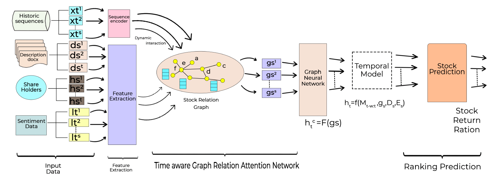
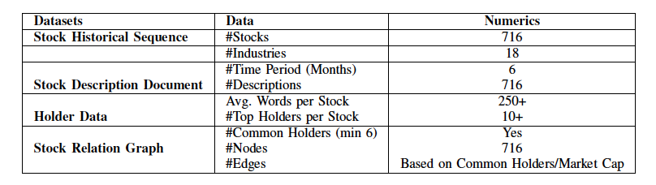
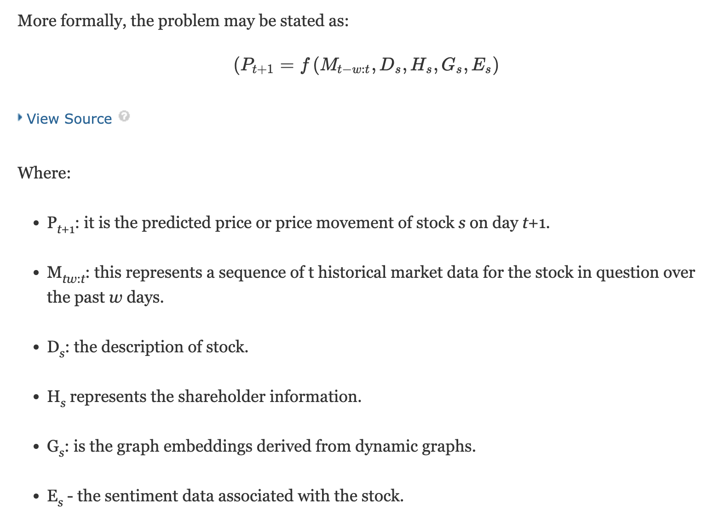
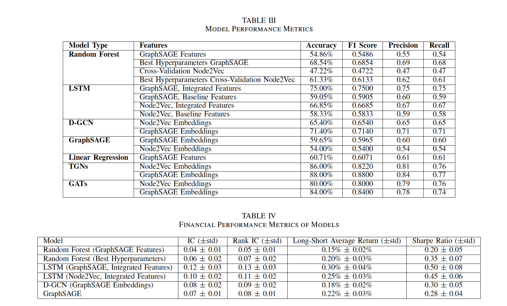

# 📈 Multi-Modal Stock Return Prediction using Transformers and Graph Neural Networks

This repository contains the official implementation of the paper:

> **"A Multi-Modal Transformer Architecture Combining Sentiment Dynamics, Temporal Market Data, and Macroeconomic Indicators for Sturdy Stock Return Forecasting"**  
> _Presented at IEEE International Conference on Big Data (BigData) 2024_

Link- https://ieeexplore.ieee.org/document/10825219

## 🧠 Overview

This work proposes a robust, multi-modal forecasting framework that predicts short-term stock returns by integrating:

- 📊 Historical Market Data (OHLCV)
- 📃 Stock Descriptions
- 🧾 Shareholder Information
- 💬 Sentiment Scores (from news + social media)
- 🌐 Dynamic Inter-stock Relations via Graphs

Our architecture uses **Graph Neural Networks** (GraphSAGE, Node2Vec), **temporal encoders** (LSTM, TGN), and a **multi-modal Transformer fusion mechanism** to deliver state-of-the-art return prediction accuracy and Sharpe ratio performance.


## 🏗️ Architecture Overview



### Modules:
- **Input Streams**:
  - Historical Sequences
  - Description Documents
  - Shareholder Records
  - Sentiment Time Series
- **Feature Encoders**:
  - Sequence Encoder for price data
  - Text encoders for stock description
  - Graph Construction for stock relations
- **Graph Embedding**:
  - Node2Vec / GraphSAGE
- **Temporal Modeling**:
  - LSTM / TGN / GAT
- **Output**:
  - Next-day return prediction
  - Stock ranking based on expected returns


## 📂 Project Structure

<pre> <code>## 📂 Project Structure <details> <summary>Click to expand</summary> ```bash A-Multi-Modal-Transformer-Architecture-Combining-Sentiment-Dynamics-Temporal-Market-Data/ ├── Base-Line Models/ # Baseline models (Random Forest, Linear Regression) ├── Data collection Scripts/ # Scripts to fetch, clean, and align data ├── Graph Creation/ # Dynamic graph construction ├── Main Models & Node Embedding/ # Transformer, LSTM, TGN, Node2Vec, GraphSAGE ├── Recommendation Scripts/ # Stock ranking logic ├── csv/ # Preprocessed CSV datasets ├── utils/ # Figures, visuals, supporting artifacts │ ├── dataset.png │ ├── metrics_1.png │ ├── metrics_2.png │ └── Model_Architecture.png ├── LICENSE ├── Presentation.pptx └── README.md ``` </details> </code> </pre>


## 📊 Dataset

We curated a 6-month dataset of 716 technology-sector stocks with:

- Daily OHLCV values
- Sector and industry descriptions
- Top institutional holders
- Sentiment from Twitter & financial news (BERT-based)
- Generated dynamic inter-stock graphs based on industry & common holders




## 🔍 Problem Statement




## 📈 Evaluation Metrics

| Metric                  | Description                                      |
|-------------------------|--------------------------------------------------|
| **Accuracy**            | Correct movement prediction                     |
| **F1 Score**            | Balance of precision and recall                 |
| **Information Coefficient (IC)** | Pearson correlation with real returns       |
| **Rank IC**             | Spearman correlation on ranking of returns      |
| **Sharpe Ratio**        | Risk-adjusted return                            |
| **Long-Short Avg Return** | Return from top vs bottom stock strategy      |

## 🧪 Results Snapshot



## 🛠️ Setup & Run

### 📦 Requirements

- Python 3.8+
- PyTorch, PyTorch Geometric
- Transformers (HuggingFace)
- scikit-learn, pandas, numpy

### ⚙️ Installation

```bash
git clone https://github.com/abhishekjoshi007/A-Multi-Modal-Transformer-Architecture-Combining-Sentiment-Dynamics-Temporal-Market-Data
cd A-Multi-Modal-Transformer-Architecture-Combining-Sentiment-Dynamics-Temporal-Market-Data
pip install -r requirements.txt
````

### 🚀 Training

```bash
python train.py --model tgn --graph graphsage --epochs 100
```

Arguments:

* `--model`: `lstm`, `gat`, `tgn`, `d-gcn`
* `--graph`: `node2vec`, `graphsage`

## 📌 Citation

If you use this work, please cite:

```bibtex
@INPROCEEDINGS{10825219,
  author={Joshi, Abhishek and Koda, Jahnavi Krishna and Hadimlioglu, Alihan},
  booktitle={2024 IEEE International Conference on Big Data (BigData)}, 
  title={A Multi-Modal Transformer Architecture Combining Sentiment Dynamics, Temporal Market Data, and Macroeconomic Indicators for Sturdy Stock Return Forecasting}, 
  year={2024},
  pages={4896-4902},
  doi={10.1109/BigData62323.2024.10825219}
}
```

## 📬 Contact

For questions, collaborations, or feedback:

* 💼 [LinkedIn – Abhishek Joshi](https://www.linkedin.com/in/abhishek-joshi-510b68151/)
* 📧 Email: [abhishek.07joshi@gmail.com](mailto:abhishek.07joshi@gmail.com)

## 🙏 Acknowledgments

Special thanks to:

* Texas A\&M University–Corpus Christi
* IEEE Big Data 2024 Committee
* Open-source contributors to PyTorch Geometric and HuggingFace

